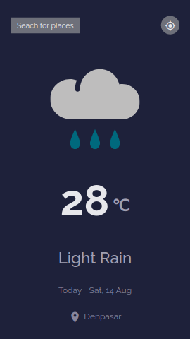
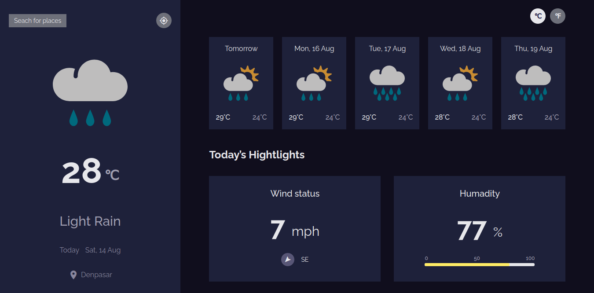
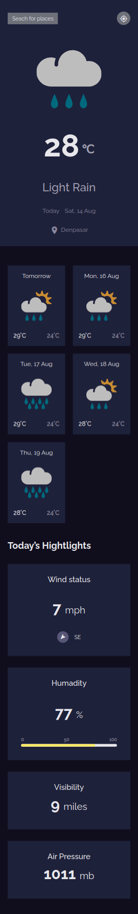

# Weather App

  

## Features

- can see city weather as default, preferably my current location
- can search for city
- can see weather of today and the next 5 days
- can see the date and location of the weather
- can see according to image for each type of weather
- can see the min and max degree each day
- can see wind status and wind direction
- can see humidity percentage
- can see a visibility indicator
- can see the air pressure number
- can request my current location weather
- can convert temperature in Celcius to Fahrenheit (only desktop version)

## Built with

- HTML
- CSS (Flexbox, Grid, Animation, & more)
- JavaScript

## Screenshot

 
  

 
  

## Links

- Solution URL: [See Solution](https://devchallenges.io/solutions/SIw7WGigrWhzgNbcDOKj/)
- Demo URL: [See Demo](https://modest-noyce-9b650e.netlify.app/)
